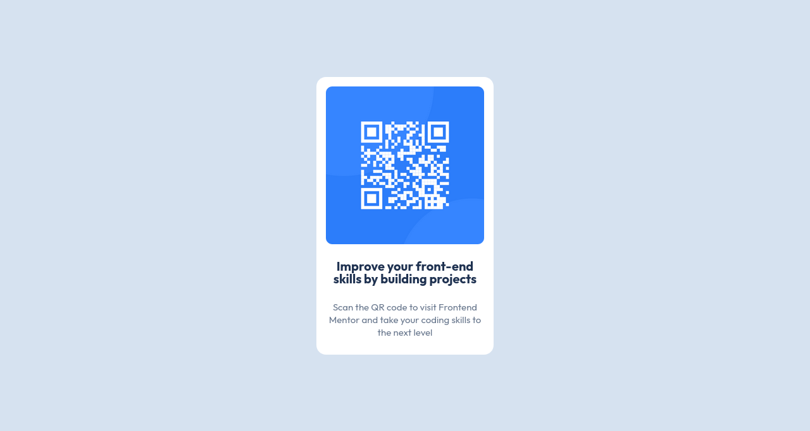

## Table of contents

- [Overview](#overview)
  - [Screenshots](#screenshots)
  - [Links](#links)
- [My process](#my-process)
  - [Built with](#built-with)
  - [What I learned](#what-i-learned)
  - [Continued development](#continued-development)
- [Author](#author)
- [Acknowledgments](#acknowledgments)

## Overview

### Screenshots

### Links

- Solution URL: [Add solution URL here](https://your-solution-url.com)
- Live Site URL: [Add live site URL here](https://your-live-site-url.com)

## My process

### Built with

- Flexbox
- CSS custom properties
- Nexted layout technique

### What I learned

Learnt it's best to just style the inner contents, and let them determine the width and height of thier containers.

Tried giving the container a fixed width which didn't allow it's content scale properly.

### Continued development

Still struggle with giving elements good enough names. I spend alot of time thinking about good names to give my elements.

## Author

- Frontend Mentor - [@yourusername](https://www.frontendmentor.io/profile/yourusername)